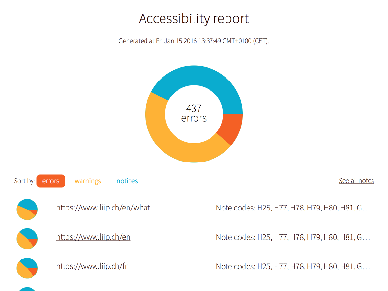
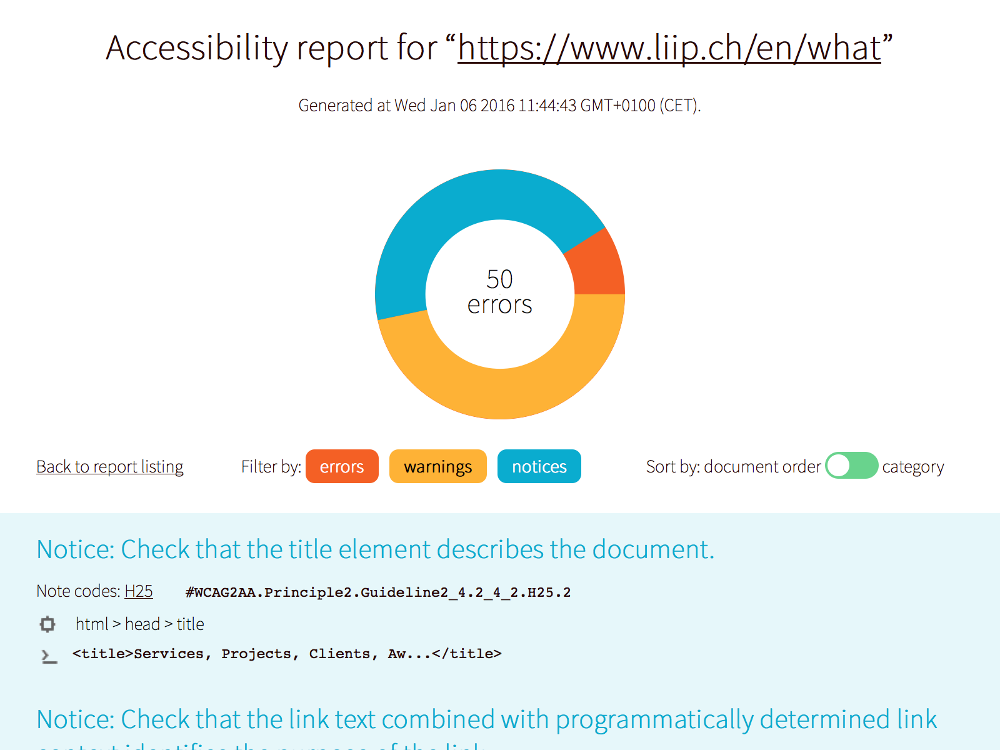
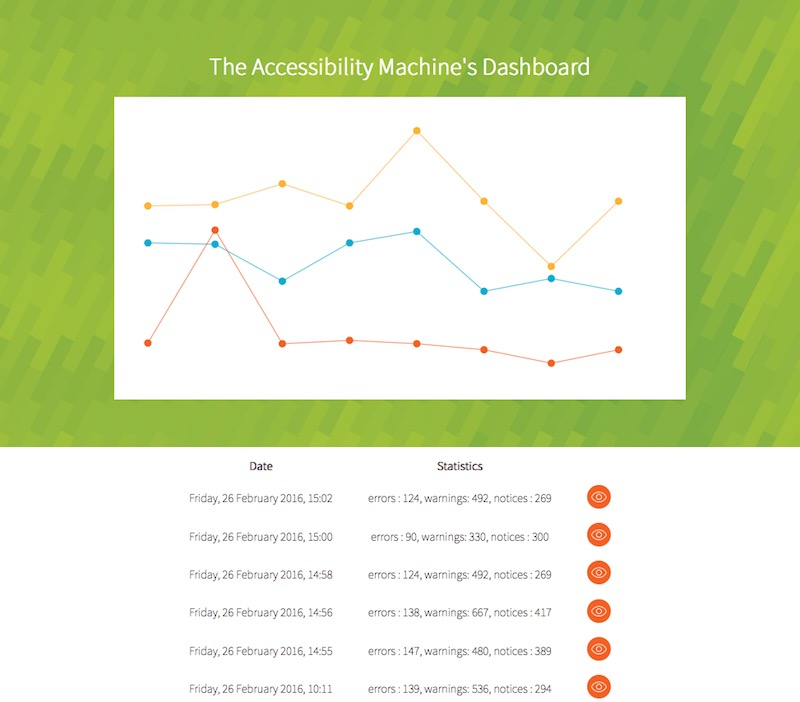

<p align="center">
  <a href="https://liip.ch/"></a><br />
  <em>presents</em><br />
  The Accessibility Testing Machine
</p>

<hr />

# The A11y Machine

[](https://github.com/liip/TheA11yMachine)
[](https://www.npmjs.com/package/the-a11y-machine)
[](#authors-and-license)

**The A11y Machine** (or `a11ym` for short, spelled “alym”) is an **automated
accessibility testing tool** which **crawls** and **tests** pages of any Web
application to produce detailed reports. It validates pages against the
following specifications/laws:

  * [W3C Web Content Accessibility Guidelines](http://www.w3.org/TR/WCAG20/)
    (WCAG) 2.0, including A, AA and AAA levels ([understanding levels of
    conformance](http://www.w3.org/TR/UNDERSTANDING-WCAG20/conformance.html#uc-levels-head)),
  * U.S. [Section 508](http://www.section508.gov/) legislation,
  * [W3C HTML5 Recommendation](https://www.w3.org/TR/html/).

## Table of contents

* [Why?](#why)
* [Installation](#installation)
* [Usage](#usage)
  * [List of URLs instead of crawling](#list-of-urls-instead-of-crawling)
  * [Possible output](#possible-output)
  * [How does it work?](#how-does-it-work)
  * [Write your custom rules](#write-your-custom-rules)
  * [Watch the dashboard](#watch-the-dashboard)
* [Roadmap and board](#roadmap-and-board)
* [Authors and license](#authors-and-license)

## Why?

If **privacy** matters for you, you're likely to install The A11y Machine over
any SaaS services: It runs locally so you don't need to send your code
somewhere, you can test all parts of your application including the ones which
require an authentification (like a checkout, a back-office etc.)…

Here are some pros and cons compared to SaaS solutions:

Properties | The A11y Machine | SaaS services
-----------|------------------|---------------
Can run locally              | yes | no
Can test each patch          | yes | no (except if deployed)
Reduce the test loop         | yes | no (the loop is longer)
Can test private code        | yes | no (you must send your code)
Can test auth-required parts | yes | no
Can crawl all your pages     | yes | yes (but it can be pricey)

Accessibility is not only a concern for disabled people. Bots can be considered
as such, like [DuckDuckGo](https://duckduckgo.com),
[Google](https://google.com/) or [Bing](https://bing.com/). By respecting these
standards, you're likely to have a better ranking. Also it helps to clean your
code. Accessibility issues are often left unaddressed for budget reasons. In
fact most of the cost is spent looking for errors on your website. The A11y
Machine greatly help with this task, you can thus focus on fixing your code and
reap the benefits.

## Installation

[NPM](http://npmjs.org/) is required. Then, execute the following lines:

```sh
$ npm install -g the-a11y-machine
```

If you would like to validate your pages against the HTML5 recommendation, then
you need to [install Java](https://www.java.com/en/download/).

As an alternative you can run a Docker image instead, which will ensure the image
is available locally:

```sh
$ docker build -t liip/the-a11y-machine .
$ docker run liip/the-a11y-machine --help
```

To get access to a report you will need to:

  * Mount a path into the container,
  * Specifify that internal path in your `a11ym` CLI options.

For example:

```sh
$ docker run -v $PWD:/var/output liip/the-a11y-machine -o /var/output http://example.org
```

## Usage

As a prelude, see the help:

```sh
  Usage: a11ym [options] url …

  Options:

    -h, --help                                 output usage information
    -b, --bootstrap <path>                     Bootstrap file, i.e. the configuration file. All CLI options will overwrite options defined in the configuration file.
    -e, --error-level <error_level>            Minimum error level: In ascending order, `notice` (default), `warning`, and `error` (e.g. `warning` includes all warnings and errors).
    -c, --filter-by-codes <codes>              Filter results by comma-separated WCAG codes (e.g. `H25,H91,G18`).
    -C, --exclude-by-codes <codes>             Exclude results by comma-separated WCAG codes (e.g. `H25,H91,G18`).
    -d, --maximum-depth <depth>                Explore up to a maximum depth (hops).
    -m, --maximum-urls <maximum_urls>          Maximum number of URLs to compute.
    -o, --output-directory <output_directory>  Output directory.
    -r, --report <report>                      Report format: `cli`, `csv`, `html` (default), `json` or `markdown`.
    -s, --standards <standards>                Standard to use: `WCAG2A`, `WCAG2AA` (default), ` WCAG2AAA`, `Section508`, `HTML` or your own (see `--sniffers`). `HTML` can be combined with any other by a comma.
    -S, --sniffers <sniffers>                  Path to the sniffers file, e.g. `resource/sniffers.js` (default).
    -u, --filter-by-urls <urls>                Filter URL to test by using a regular expression without delimiters (e.g. 'news|contact').
    -U, --exclude-by-urls <urls>               Exclude URL to test by using a regular expression without delimiters (e.g. 'news|contact').
    -w, --workers <workers>                    Number of workers, i.e. number of URLs computed in parallel.
    --http-auth-user <http_auth_user>          Username to authenticate all HTTP requests.
    --http-auth-password <http_auth_password>  Password to authenticate all HTTP requests.
    --http-tls-disable                         Disable TLS/SSL when crawling or downloading pages.
    -V, --no-verbose                           Make the program silent.

```

Thus, the simplest use is to run `a11ym` with a URL:

```sh
$ ./a11ym http://example.org/
```

All URLs accessible from `http://example.org/` will be tested against the
WCAG2AA standard. See the `--maximum-urls` options to reduce the number of
URLs to test.

Then open `a11ym_output/index.html` and browser the result!

### List of URLs instead of crawling

You can compute several URLs by adding them to the command-line, like this:

```sh
$ ./a11ym http://example.org/A http://example.org/B http://example.org/C
```

Alternatively, this is possible to read URLs from STDIN, as follows:

```sh
$ cat URLs.lists | ./a11ym -
```

Note the `-`: It means “Read URLs from STDIN please”.

When reading several URLs, the `--maximum-depth` option will be forced to 1.

### Possible output

The index of the reports:



Report of a specific URL:



The dashboard of all reports:



### Selecting standards

As mentionned, the following standards are supported:
  * W3C WCAG,
  * U.S. Section 508 legislation,
  * W3C HTML5 recommendation.

You cannot combine standards between each other, except HTML5 that can be
combined with any other. So for instance, to run `WCAG2AAA`:

```sh
$ ./a11ym --standards WCAG2AAA http://example.org/
```

To run `WCAG2AA` along with `HTML`:

```sh
$ ./a11ym --standards WCAG2AA,HTML http://example.org/
```

### How does it work?

The pipe looks like this:

  1. The [`node-simplecrawler`](https://github.com/cgiffard/node-simplecrawler/)
     tool is used to crawl a Web application based on the given URLs, with **our
     own specific exploration algorithm** to provide better results quickly, in
     addition to support **parallelism**,
  2. For each URL found, 2 kind of tests are applied:
      1. **Accessibility**: [PhantomJS](http://phantomjs.org/) runs and
         [`HTML_CodeSniffer`](https://github.com/squizlabs/HTML_CodeSniffer) is
         injected in order to check the page conformance; This step is
         semi-automated by the help of
         [`pa11y`](https://github.com/nature/pa11y), which is a very thin layer
         of code wrapping PhantomJS and `HTML_CodeSniffer`,
      2. **HTML**: [The Nu Html Checker](http://validator.github.io/validator/)
         (v.Nu) is run on the same URL.
  3. Finally, results from different tools are normalized, and enhanced and easy
     to use reports are produced.

PhantomJS and `HTML_CodeSniffer` are widely-used, tested and precise tools.
`pa11y` simplifies the use of these two latters. The Nu Html Checker is the tool
used by the W3C to validate documents online. However, in this case, we **do all
validations offline**! Nothing is sent over the network. Again, privacy.

### Write your custom rules

`HTML_CodeSniffer` is build in a way that allows you to extend existing rules or
write your own. A rule is represented as a sniffer (this is another
terminology). The `resource/sniffers/` directory contains an example of
a custom sniffer.

The A11y Machine comes with a default file containing all the sniffers:
`resource/sniffers.js`. You can provide your own by using the `--sniffers`
option. To build your own sniffers, simply copy the `resource/sniffers/`
somewhere as a basis, complete it, then compile it with the `a11ym-sniffers`
utility:

```sh
$ ./a11ym-sniffers --directory my/sniffers/ --output-directory my_sniffers.js
```

Then, to effectively use it:

```sh
$ ./a11ym --sniffers my_sniffers.js --standard MyStandard http://example.org/
```

### Watch the dashboard

Run the `a11ym-dashboard` command to serve the dashboard. The dashboard is an
overview of several reports generated by the `a11ym` command. The command can
serves the dashboard over HTTP, or over static files. In addition to requiring
a root directory, it requires: In the first case, an address, and a port, in the
second, nothing more than just a flag. For instance, if the reports are
generated with the following command:

```sh
$ ./a11ym --output-directory my_reports/`date +%s`/ http://example.org/A http://example.org/B
```

Then, the root directory is `my_reports/` and thus the dashboard will be started
over HTTP with the following command:

```sh
$ ./a11ym-dashboard --root my_reports
```

Browse `127.0.0.1:8080` (by default) to see the dashboard!

Or to generate static files:

```sh
$ ./a11ym-dashboard --root my_reports --static-output
```

Open `my_reports/index.html`, and do the same!

Bonus: Use the `--open` option to automatically open the dashboard in your
favorite browser.

## Roadmap and board

The roadmap is public:
  * See [the incoming
    milestones](https://github.com/liip/TheA11yMachine/milestones),
  * See [the in progress
    issues](https://github.com/liip/TheA11yMachine/labels/in%20progress).

The board is publicly available at the following URL: https://waffle.io/liip/TheA11yMachine.

## Authors and license

Original author is [Ivan Enderlin](http://mnt.io/), accompagnied by [Gilles
Crettenand](https://github.com/krtek4) and [David
Jeanmonod](https://github.com/jeanmonod). This software is backed by
[Liip](https://liip.ch/).

[BSD-3-Clause](http://opensource.org/licenses/BSD-3-Clause):

> Copyright (c), Ivan Enderlin and Liip
> All rights reserved.
>
> Redistribution and use in source and binary forms, with or without modification,
> are permitted provided that the following conditions are met:
>
> 1. Redistributions of source code must retain the above copyright notice, this
>    list of conditions and the following disclaimer.
>
> 2. Redistributions in binary form must reproduce the above copyright notice,
>    this list of conditions and the following disclaimer in the documentation
>    and/or other materials provided with the distribution.
>
> 3. Neither the name of the copyright holder nor the names of its contributors
>    may be used to endorse or promote products derived from this software without
>    specific prior written permission.
>
> THIS SOFTWARE IS PROVIDED BY THE COPYRIGHT HOLDERS AND CONTRIBUTORS "AS IS" AND
> ANY EXPRESS OR IMPLIED WARRANTIES, INCLUDING, BUT NOT LIMITED TO, THE IMPLIED
> WARRANTIES OF MERCHANTABILITY AND FITNESS FOR A PARTICULAR PURPOSE ARE
> DISCLAIMED. IN NO EVENT SHALL THE COPYRIGHT HOLDER OR CONTRIBUTORS BE LIABLE FOR
> ANY DIRECT, INDIRECT, INCIDENTAL, SPECIAL, EXEMPLARY, OR CONSEQUENTIAL DAMAGES
> (INCLUDING, BUT NOT LIMITED TO, PROCUREMENT OF SUBSTITUTE GOODS OR SERVICES;
>  LOSS OF USE, DATA, OR PROFITS; OR BUSINESS INTERRUPTION) HOWEVER CAUSED AND ON
> ANY THEORY OF LIABILITY, WHETHER IN CONTRACT, STRICT LIABILITY, OR TORT
> (INCLUDING NEGLIGENCE OR OTHERWISE) ARISING IN ANY WAY OUT OF THE USE OF THIS
> SOFTWARE, EVEN IF ADVISED OF THE POSSIBILITY OF SUCH DAMAGE.
